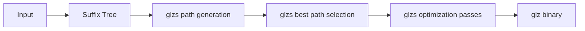

# glz
A custom, purpose-built compression algorithm optimized for high compression ratios

## How it works
- Dictionaries are built as backreferences, permitting streaming
- Suffix trees for detection of repeats and near repeats
- Flags for correcting near repeats
- Flags for predictable tokens
- Flags for repeats

## Considerations
- Range/Arithmetic coding
- Near matching by making the substring a part of the tree
- Converting suffix tree to glzs

## Pipeline
